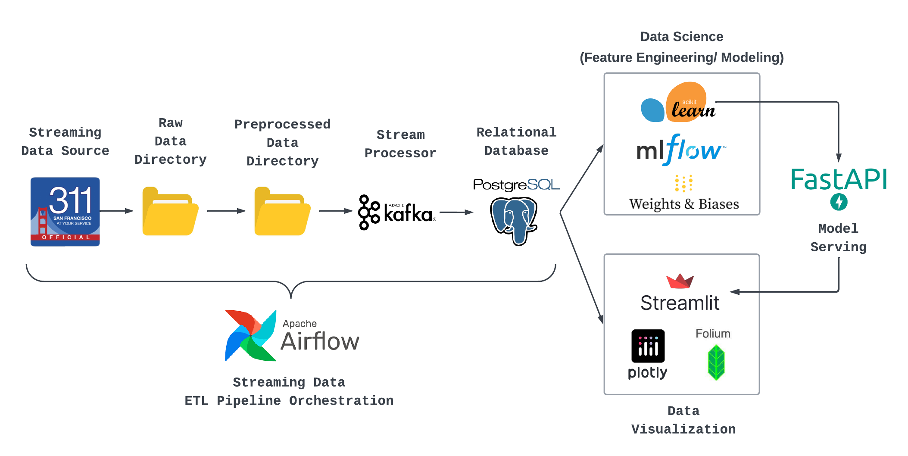

# San Francisco 311 Requests - ETL Pipeline

## Project Overview

* Summary

  San Franciscofaces the challenge of efficiently managing and addressing the diverse array of incidents reported through its 311 system. With a continuous influx of cases, there is a pressing need to streamline the allocation of resourcesand enhance response times to improve service quality.
* Objectives

  * **Streaming Data ETL Pipeline**:Leveraging skills from Data Streaming course to build a real-time streaming data pipeline.
  * **Data Visualization**: Mapping 311 cases across the city to identify hotspots and patterns.
  * **Request Resolved Time Prediction**:Using machine learning to predict case closure times, considering factors like case type and location.**

## Architecture Diagram

## Dataset

* Open source dataset managed by San Francisco Government
* Dataset Creation:October, 2011
* Update frequency: Daily (multiple times per hour)
* Dataset Size: 2.2 GB
* Number of Records: 6.6 M
* Features:48 ()interpretable: 15)
* Source: [https://data.sfgov.org/City-Infrastructure/311-Cases/vw6y-z8j6/explore](https://data.sfgov.org/City-Infrastructure/311-Cases/vw6y-z8j6/explore)

## Tools & Packages

* **Data Orchestration**:apache-airflow, sodapy
* **Data Streaming**:avro,confluent_kafka, fastavro
* **Database**: pgAdmin, psycopg2, sqlalchemy
* **Modeling & Serving**: fastapi[all], mlflow, scikit-learn
* **Data Visualization**: geopandas, folium, numpy, pandas, plotly, streamlit
* **Version Control**: git, Github
